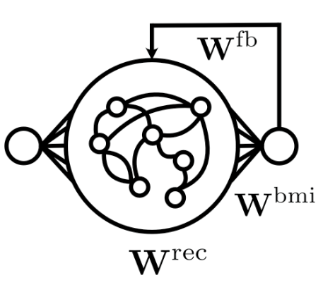

# Biological Learning Rules for BMI-inspired RNNs

This repository allows for mixing and matching biologically plausible learning rules for vanilla RNNs, with a focus on tasks and constraints inspired by Brain Machine Interface (BMI) experiments in non-human primates.

The following repository was custom built for the NeurIPS paper [Distinguishing Learning Rules with Brain Machine Interfaces (Portes, Schmid and Murray 2022)](https://arxiv.org/abs/2206.13448).

Experiments for the NeurIPS 2022 submission are in the branch `experiments-neurips-2022`

Please contact j.portes@columbia.edu for more details.

-----
The general structure of the `simulation` class, and probes/monitors in particular, are directly inspired by Owen Marschall's repo https://github.com/omarschall/vanilla-rtrl/

The implementation for the RFLO algorithm is inspired by Murray 2019 "Local online learning in recurrent networks with random feedback" (see https://github.com/murray-lab/rflo-learning for more details)
